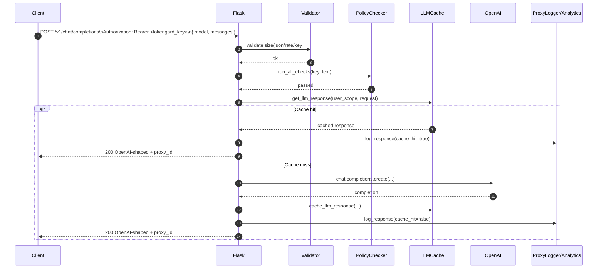

# Flask AWS App

A simple Flask application ready for deployment to AWS with a custom domain.

## Features

- 🚀 Modern, responsive landing page
- ✅ Comprehensive test suite
- 🛠️ Makefile for easy development workflow
- 📱 Mobile-friendly design
- 🔍 Health check endpoint
- 🎨 Beautiful gradient design

## Quick Start

### 1. Setup Development Environment

```bash
# Create and activate virtual environment
python3 -m venv venv
source venv/bin/activate  # On macOS/Linux
# On Windows: venv\Scripts\activate

# Install dependencies
make install
```

### 2. Run the Application

```bash
# Start Flask app locally
make run

# Visit http://localhost:5000 in your browser
```

### 3. Run Tests

```bash
# Run all tests
make test

# Run all checks (lint + test)
make check
```

### Semantic Cache (LLM Proxy)

The LLM proxy uses a semantic cache backed by embeddings to return cached responses for prompts that are meaningfully similar, not just exact string matches.

- Model: `SentenceTransformer('all-MiniLM-L6-v2')`
- Similarity: cosine similarity with threshold 0.89
- Behavior:
  - On each request, we embed the prompt text and compare with cached embeddings per user.
  - If any cached prompt has cosine similarity ≥ 0.89, we return the cached response immediately and mark the response as from cache.
  - Otherwise, we call the LLM, then store the prompt, its embedding, and the response.

Install requirements including sentence-transformers:

```bash
pip install -r requirements.txt
```

Notes:
- The embedding model is loaded once lazily on first use inside the process.
- Analytics and logs include cache hit rates and cost savings; when semantic hits occur, we log the similarity score.

### Token Counting & Cost Estimation

Token counting uses OpenAI's tiktoken with model-aware encodings. Per-1k pricing is configured in `pricing.json`.

- Module: `app/utils/token_utils.py`
- Functions:
  - `count_tokens(text, model)` → token count using tiktoken
  - `estimate_cost(token_count, model, is_output=False)` → USD cost using `pricing.json`
- Proxy response is OpenAI-shaped with one extra field `proxy_id` used to fetch detailed logs. Example success response:

```json
{
  "id": "chatcmpl-123",
  "object": "chat.completion",
  "created": 1712345678,
  "model": "gpt-4o",
  "choices": [
    {
      "index": 0,
      "message": {"role": "assistant", "content": "Mock LLM response for: ..."},
      "finish_reason": "stop"
    }
  ],
  "usage": {
    "prompt_tokens": 12,
    "completion_tokens": 24,
    "total_tokens": 36
  },
  "proxy_id": "xxxxxxxx-xxxx-xxxx-xxxx-xxxxxxxxxxxx"
}
```

- Error responses follow the OpenAI error envelope:

```json
{
  "error": {
    "message": "API key not found.",
    "type": "API_KEY_NOT_FOUND",
    "param": null,
    "code": "API_KEY_NOT_FOUND"
  }
}
```

### Calling the Proxy (OpenAI-compatible)

- Endpoint: `POST /v1/chat/completions` (alias: `POST /api/proxy`)
- Auth: `Authorization: Bearer <tokengard_api_key>` (Tokengard key only)
- Body: either OpenAI-style `messages` or a simple `text` string

Request example (OpenAI-style):

```json
{
  "model": "gpt-4o",
  "messages": [
    {"role": "system", "content": "You are a helpful assistant."},
    {"role": "user", "content": "Say hello"}
  ],
  "temperature": 0.7,
  "max_tokens": 128
}
```

Notes:
- Clients send only the Tokengard API key. Do not send an OpenAI key. The proxy loads provider credentials from the server-side environment variable `OPEN_AI_API_KEYS` (comma-separated keys) and uses them when calling the provider in production.
- In test/dev without `OPEN_AI_API_KEYS`, the proxy returns a stubbed OpenAI-shaped response.
- We also accept `text` and will wrap it into a minimal `messages` array internally.

### Secure Proxy Logs Lookup

- Endpoint: `/api/logs/<proxy_id>` accepts the UUID `proxy_id` returned in responses.
- Auth: Requires a valid API key belonging to the owner of the log. The key can be provided via JSON (`{"api_key": "..."}`), query string (`?api_key=...`), or `X-API-Key` header.
- Returns detailed proxy log and analytics for correlation using `proxy_id`.

## Available Make Commands

- `make help` - Show all available commands
- `make install` - Install dependencies
- `make run` - Run Flask app locally
- `make test` - Run tests
- `make clean` - Clean up cache files
- `make lint` - Check code style
- `make format` - Format code
- `make check` - Run all checks
- `make prod-run` - Run with gunicorn (production-like)

## Project Structure

```
flask-aws-app/
├── app.py              # Main Flask application
├── requirements.txt    # Python dependencies
├── Makefile           # Development commands
├── test_app.py        # Test suite
├── templates/          # HTML templates
│   └── index.html     # Landing page
└── static/            # Static assets
    └── css/
        └── style.css  # Stylesheets
```

## Testing

The app includes comprehensive tests covering:
- Home page loading
- Health endpoint
- Content validation
- Error handling
- HTML structure

Run tests with: `make test`

## Next Steps: AWS Deployment

This app is ready for AWS deployment with:
1. S3 bucket for static hosting
2. CloudFront for CDN
3. Route 53 for custom domain
4. SSL certificate

## Development Workflow

1. **Local Development**: `make run` → test at localhost:5000
2. **Testing**: `make test` → verify functionality
3. **Code Quality**: `make check` → lint + test
4. **Deploy**: Ready for AWS deployment

## Requirements

- Python 3.8+
- Flask 3.0.0
- pytest for testing
- gunicorn for production

## Proxy Flow Diagram

```mermaid
flowchart TD
  A[Client App] -->|Authorization: Bearer <tokengard_key>\nPOST /v1/chat/completions| B[Flask /api/proxy alias]
  A -->|Optional: messages or text| B
  B --> C[APIRequestValidator]
  C -->|size/rate ok| D[Extract Tokengard API key]
  C -->|invalid JSON / too large / rate limited| E[OpenAI-style Error Envelope]
  D --> F[PolicyChecker]
  F -->|fail (key inactive, banned word, etc.)| E
  F -->|pass| G[LLMCacheLookup]
  G -->|semantic cache hit| H[Build OpenAI-shaped response + proxy_id]
  H --> I[ProxyLogger + Metrics]
  I --> J[Return 200]
  G -->|miss| K{OPEN_AI_API_KEYS set?}
  K -->|yes| L[Call OpenAI Chat Completions]
  K -->|no (dev/test)| M[Return stubbed OpenAI-shaped response]
  L --> N[Normalize provider response]
  N --> O[Cache response (per-user scope)]
  M --> O
  O --> I

  subgraph Observability & Analytics
    I --> P[ProxyLog row]
    I --> Q[ProxyAnalytics]
    I --> R[ProviderAnalytics]
  end

  S[Logs API /api/logs/<proxy_id>] -->|Requires Tokengard key\n(owner-only)| P
```

### Sequence (OpenAI-style request)


